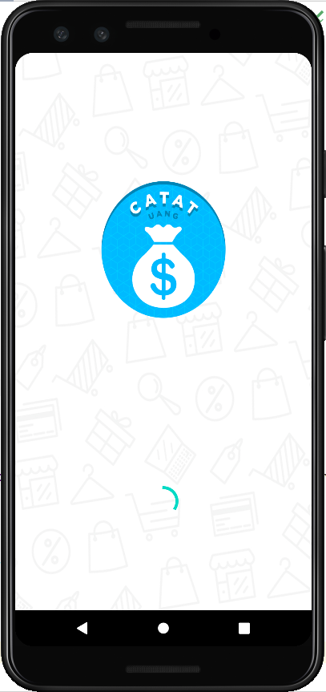
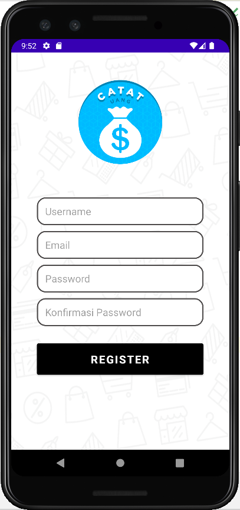
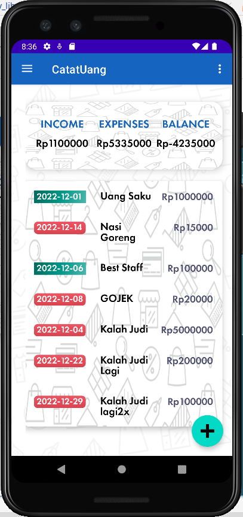
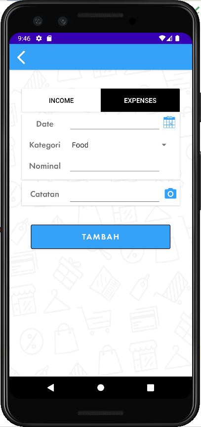
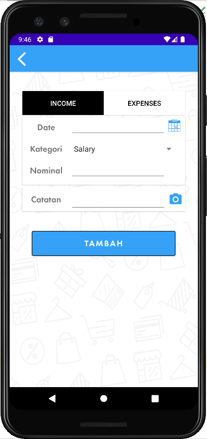
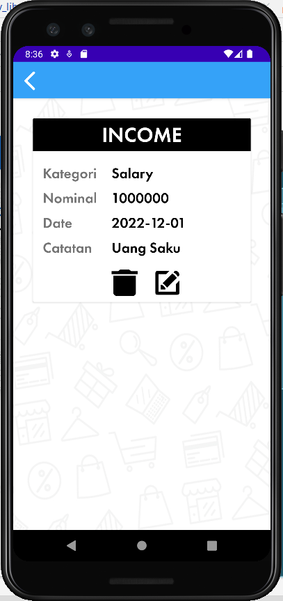
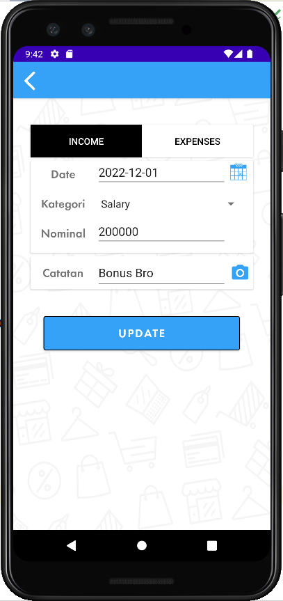
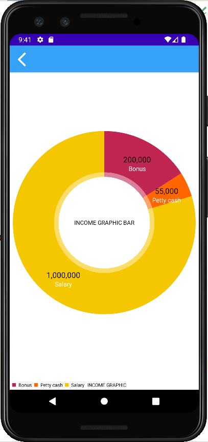
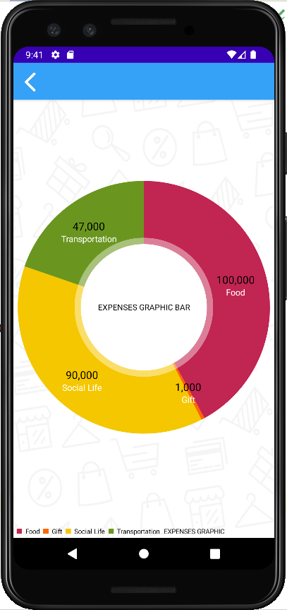
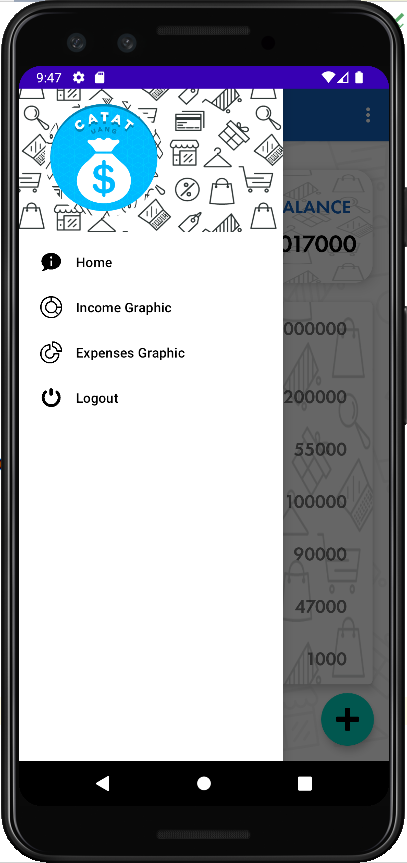

## Finance Manager - Приложение для Android
Приложения для облегчения учета финансовых операций

## Описание приложения
Finance Manager - это приложение, которое помогает пользователям вести финансовый учет, чтобы можно было легко отслеживать доходы и расходы. Record money позволяет легко управлять нашими личными финансами, чтобы мы могли записывать и документировать наши личные или деловые финансовые транзакции, просматривать наши ежедневные финансовые данные и управлять нашими финансовыми активами.
Finance Manager также может отображать наши доходы и расходы на основе графиков, чтобы мы могли быстро увидеть процент расходов по вашим активам и сделать правильные финансовые выводы. В этом приложении есть функция регистрации учетной записи и входа в систему, с помощью этой функции только владельцы учетных записей могут просматривать финансовые записи и управлять ими.

## Поддержка приложений
* SQLite - как база данных для хранения пользовательских данных и записей о расходах
* Recycler View - отображает данные в виде списка, примененного к домашней странице.
* MP Android Chart - для упрощения представления финансовых данных пользователя, применяемых на странице диаграммы доходов и расходов.
* Camera API - чтобы пользователям было проще что-то документировать, применяется на странице Добавления заметок.
* Средство выбора даты - чтобы пользователям было проще выбирать дату, оно применяется на странице добавления заметок и редактирования заметок.
* Заставка - для создания внешнего вида при открытии приложения в процессе загрузки, чтобы сделать его более интересным

## Скриншоты приложений
### 1. Страница загрузки приложения
Страница, когда в процессе загрузки открывается приложение, используя заставку   

### 2. Авторизоваться
Перед использованием приложения пользователь должен сначала войти в систему, указав адрес электронной почты и пароль, которые были зарегистрированы. Если у пользователя нет учетной записи, пользователь должен сначала зарегистрироваться на странице регистрации, нажав кнопку “Зарегистрироваться”.   

### 3. Зарегистрировать
На этой странице пользователь может создать учетную запись для входа в приложение, пользователь должен ввести имя пользователя, адрес электронной почты, пароль и подтверждение пароля. Если есть поля, которые не были заполнены, электронное письмо не соответствует формату или поле подтверждения пароля не совпадает по значению с паролем, появится уведомление. Если пользователь ввел данные в соответствии с положениями, нажмите кнопку зарегистрироваться, после чего учетная запись будет создана, и страница автоматически вернется на страницу входа в систему снова.   

### 4. Домой
Здесь представлена информация об общих расходах, доходах и общем балансе текущего пользователя. Подробная информация о финансовых отчетах пользователя представлена в режиме просмотра bentu recycler   

### 5. Увеличение доходов/расходов по сделкам
На главной странице нажмите кнопку "Добавить", появится страница "Добавить заметки". Чтобы записать доходы, нажмите "Доходы", если вы хотите записать расходы, нажмите "Расходы". Введите дату, нажав на значок календаря, выберите указанную категорию, введите номинал, затем введите примечание, вы также можете добавить документацию в виде фотографий в свою заметку, затем нажмите кнопку Сохранить, после чего вы автоматически вернетесь на домашнюю страницу, и только что введенная вами заметка будет автоматически сохранена. появится в режиме "утилизация"   
 

### 6. Подробное примечание
Пользователи могут просматривать финансовые записи, которые были сделаны на домашней странице, щелкая по записям, которые вы хотите просмотреть, в списке просмотра для повторного использования   

### 7. Редактировать заметки
Пользователи также могут редактировать уже сделанные заметки, нажав на заметку, которую нужно отредактировать, и нажав кнопку редактировать, после чего вы перейдете на страницу редактирования заметки, на странице редактирования заметки вы можете исправить дату, категорию, номинал и заметки о ваших финансах, затем, если это правильно, нажмите кнопку обновить, затем автоматически обновите заметки, включая результаты   

### 8. Удалять заметки
Если есть запись, которую вы хотите удалить, пользователь может удалить запись, щелкнув по записи, которую нужно удалить, и нажав кнопку "Удалить", после чего у вас появится диалоговое окно с предупреждением, чтобы подтвердить, уверен ли пользователь в удалении, если вы уверены, что хотите удалить, немедленно нажмите "да". кнопка, затем автоматически выполняется запись, включая    

### 9. Ежедневный доход
Пользователь может увидеть график доходов, который он получает, на домашней странице, выбрать меню боковой панели и нажать меню “график доходов”, после чего вы перейдете на страницу "График доходов", которая содержит круговую диаграмму доходов в разбивке по категориям доходов.   

### 10. Ежедневные расходы
Пользователь также может увидеть график произведенных им расходов, который находится в боковом меню, нажав на меню “график расходов”, после чего вы перейдете на страницу "график расходов", которая содержит круговую диаграмму произведенных расходов в сравнении с расходами по категориям   

### 13. Выход из учетной записи
Наконец, пользователь может выйти из своей учетной записи, нажав кнопку “Выйти" в боковом меню   

### 14. База данных SQLite
Для просмотра данных, необходимо установить SQLite
https://download.sqlitebrowser.org/DB.Browser.for.SQLite-3.12.2-win64.msi

